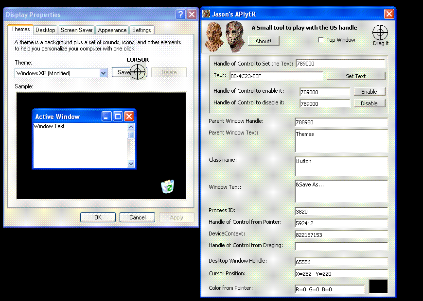



## Jason's APIyER

### Description

This is a tool for capturing certain API events.

I have made this tool for educational purpose only. Its very very simple to understand and to give you some API good functions knowledge. Please vote this tool or just give your comments.
 
### More Info
 

             |
---                |---
**Submitted On**   |2002-12-28 22:40:18
**By**             |[Evilgenious](https://github.com/Planet-Source-Code/PSCIndex/blob/master/ByAuthor/evilgenious.md)
**Level**          |Beginner
**User Rating**    |5.0 (10 globes from 2 users)
**Compatibility**  |VB 6\.0
**Category**       |[Windows API Call/ Explanation](https://github.com/Planet-Source-Code/PSCIndex/blob/master/ByCategory/windows-api-call-explanation__1-39.md)
**World**          |[Visual Basic](https://github.com/Planet-Source-Code/PSCIndex/blob/master/ByWorld/visual-basic.md)
**Archive File**   |[Jason's\_AP1973082142006\.zip](https://github.com/Planet-Source-Code/evilgenious-jason-s-apiyer__1-64326/archive/master.zip)

